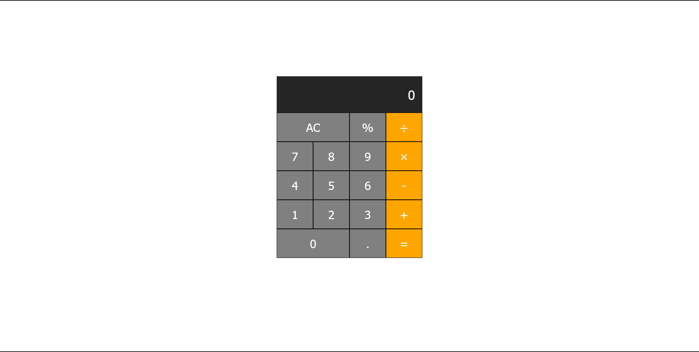

# Proyek Kalkulator

Ini adalah proyek kalkulator sederhana yang dibuat menggunakan **HTML**, **CSS**, dan **JavaScript**. Kalkulator ini memungkinkan operasi aritmatika dasar seperti penjumlahan, pengurangan, perkalian, pembagian, dan perhitungan persen.

## Fitur

- Penjumlahan, pengurangan, perkalian, dan pembagian
- Perhitungan persen
- Tombol AC (All Clear) untuk mereset kalkulator
- Desain responsif dengan tampilan profesional

## File

- **index.html**: Struktur utama dari kalkulator.
- **style.css**: CSS yang digunakan untuk tampilan kalkulator agar terlihat menarik dan responsif.
- **script.js**: Logika JavaScript untuk menangani perhitungan dan pembaruan tampilan.

## Cara Menggunakan

1. Clone repository ini atau unduh file-filenya.
2. Buka file `index.html` di browser untuk menggunakan kalkulator.
