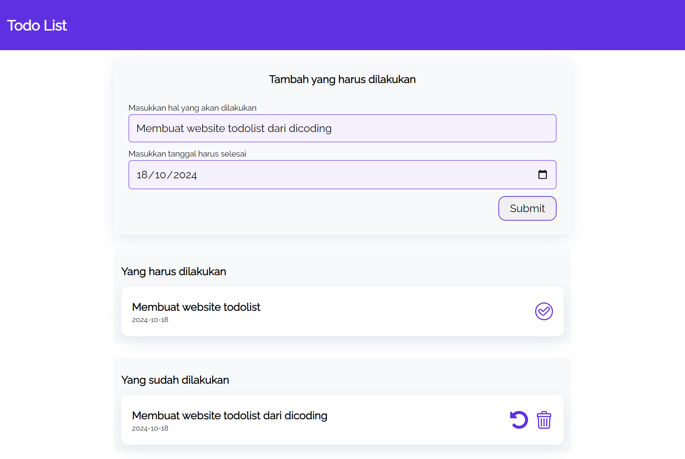

# To-Do List Sederhana

Ini adalah proyek mini **To-Do List** sederhana yang dibuat menggunakan **HTML, CSS, dan JavaScript**. Aplikasi ini memungkinkan pengguna untuk menambahkan, menandai sebagai selesai, dan menghapus tugas dari daftar. Desainnya minimalis dan responsif sehingga mudah digunakan.

## Fitur

- Menambahkan tugas baru.
- Menandai tugas sebagai selesai.
- Menghapus tugas.
- Antarmuka pengguna yang sederhana dan bersih.

## Instalasi

1. Clone atau unduh repositori ini.
2. Buka file `index.html` di browser untuk menjalankan aplikasi.

## Struktur Proyek

- `index.html` – Berisi struktur HTML untuk daftar To-Do.
- `style.css` – Berisi styling untuk antarmuka To-Do List.
- `script.js` – Berisi kode JavaScript untuk menambah, menandai, dan menghapus tugas.

## Pratinjau

Berikut adalah pratinjau dari aplikasi:

### Tampilan Awal

## Penggunaan

1. Buka halaman aplikasi.
2. Masukkan tugas di kolom input.
3. Klik tombol "Add Task" untuk menambah tugas ke daftar.
4. Klik pada tugas untuk menandainya sebagai selesai (tugas akan dicoret).
5. Klik tombol "Delete" untuk menghapus tugas.
